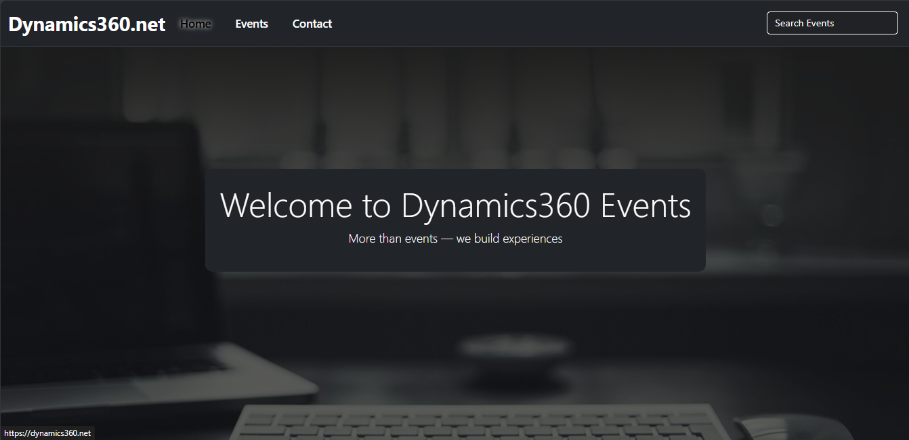
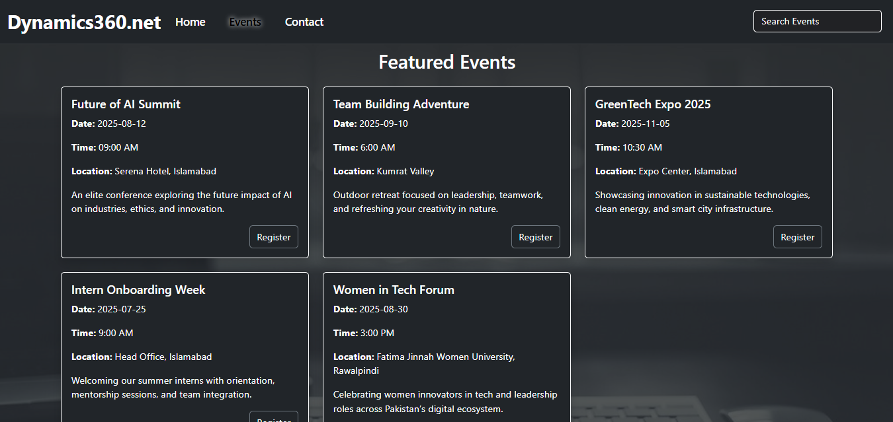
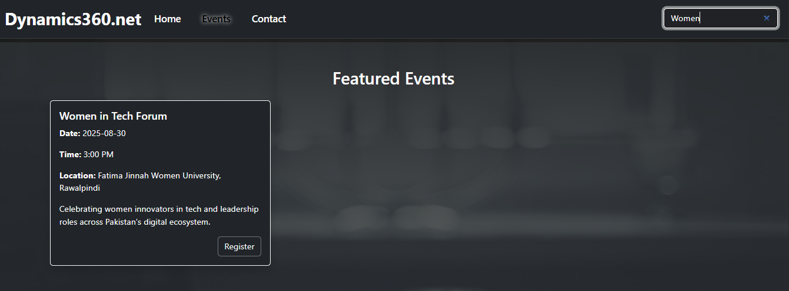
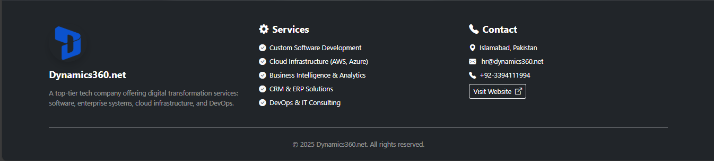

# Dynamics360.net Website

## Overview

**Dynamics360.net** is a company website built using **HTML**, **CSS**, and **JavaScript**. It includes a Home section, Events section, and Contact section. Users can view and search for events on the Events section. All files are organized inside the folders for better structure.

## Link
- https://dynamics360-events.vercel.app/


## Features

- **Home Section** (`html/index.html`): The main landing section introducing the company.
- **Events Section** (`html/events.html`): Displays a list of events with search functionality.
- **Contact Section** (`html/contact.html`): Shows company contact information.

## Project Structure
```
/
├── index.html
├── css/
│   └── styles.css
├── js/
│   ├── scripts.js
│   └── Event.json    # JSON file containing event data
└── assets/
    └── logo3.png
    └── bg.png
```

## Getting Started

To run the website locally:

1. Clone the repository:
   ```bash
   git clone https://github.com/MuhammadMahi585/Dynamics360-Events.git

2. Navigate to Project Directory:
   ```cd EVENTS```

3. Open index.html in your preferred web browser using live server extension.

## Usage

- Visit the Home Section to learn about the company.
- Use the Events Section to browse and search upcoming events.
- Go to the Contact Section for contact details.

## Technologies Used

- HTML5
- CSS3
- JavaScript

## Demo

#### Home section


#### Events section


#### Search Events section


#### Contacts section
